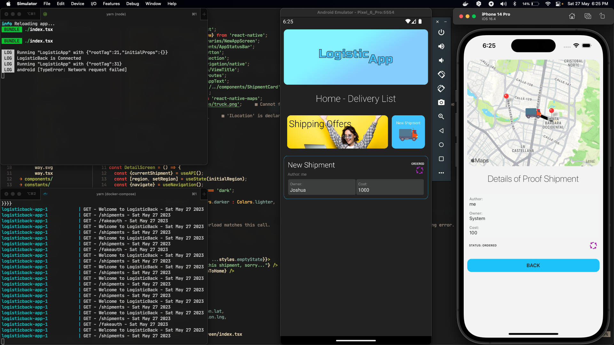

# LogisticApp

Una aplicacíon movíl de logistica para gestionar envíos hecha con React Native.

## Stack

El **Stack** seleccionado para este proyecto es MERN.

La idea es realizar una aplicación movíl que permita gestionar el estado de envíos de "X" producto.

## Necesario

Debes crear el archivo .env y colocar las siguientes variables

```
API=http://localhost:9876
MAP_API_KEY=YourApiKey

```

## Cosas por finalizar:

- [] Mejorar la interfaz del login.

- [] Desarrollar la vista de edicion de envios.

- [] Desarrollar vista de perfil.

- [] Agregar boton de logout.

## Aspectos que podría mejorar la aplicación

Usar una solución en la nube para la rapida integración de los servicios en un mvp y luego manejarlo de forma mas especifica.



**La aplicación corre optimamente en ios y android**

para el backend ver: https://github.com/joshdev15/LogisticBack
